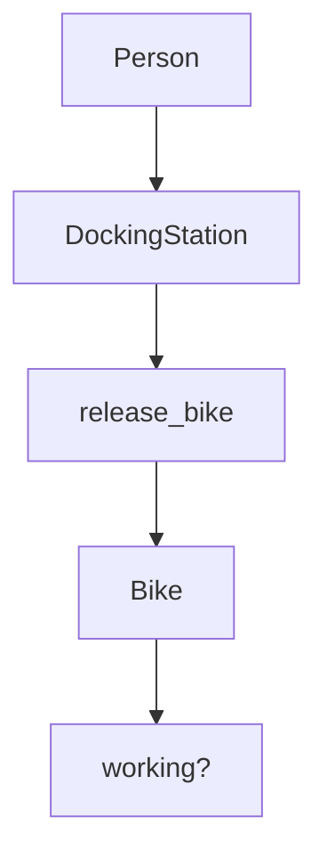
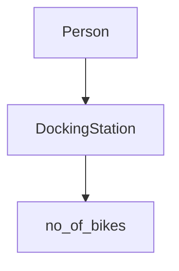

# Boris Bikes
This is a project that will emulate docking stations, bikes and infrastructure.

### Bike class
This class is for instances of bikes. They currently have an empty method called 'working' which will later check if the bikes are in a good condition.

### DockingStation class
This class is for instances of docking stations. They currently have an empty method called 'release_bike' which will later be used to release an instance of a bike from the docking station.

### Domain Model and Diagram

User Story

As a User, So that I can use a bike, I'd like a docking station to release a bike.

As a User, So that I can use a good bike, I'd like to see if a bike is working

|  Objects        |  Messages      |
| ----------      | -------------  | 
| Person          |                |
| Bike            | working?|
| DockingStation | release_bike   |

As a member of the public 
So I can decide whether to use the docking station
I want to see a bike that has been docked

|  Objects        |  Messages      |
| ----------      | -------------  | 
| Person          |                |
| Bike            | |
| DockingStation |  no_of_bikes  |

